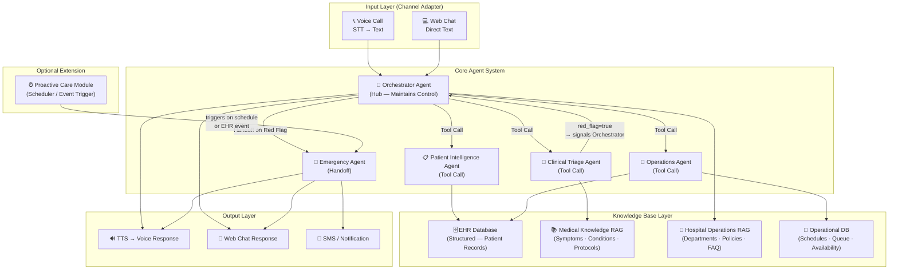
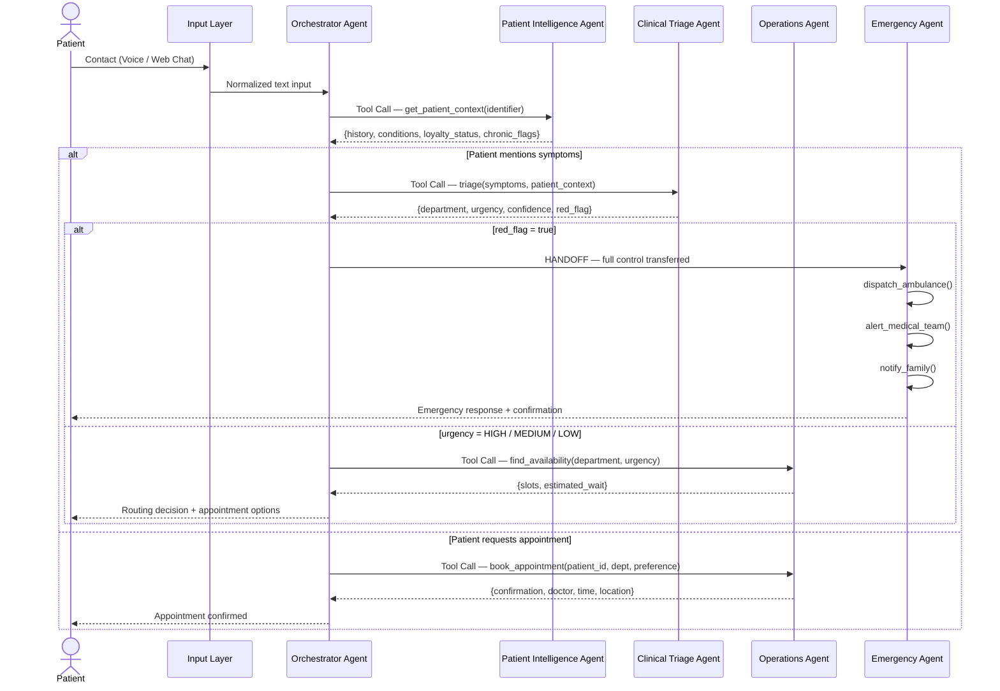
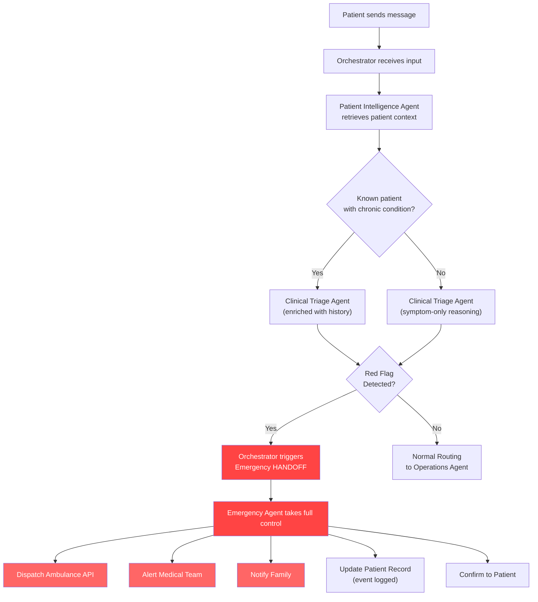
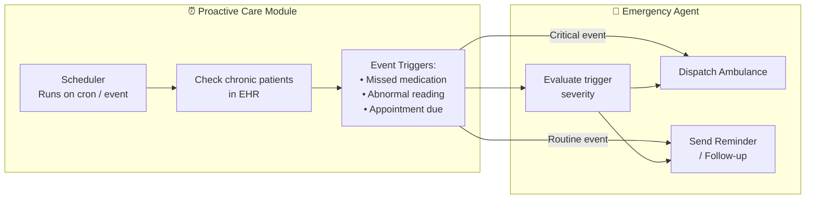
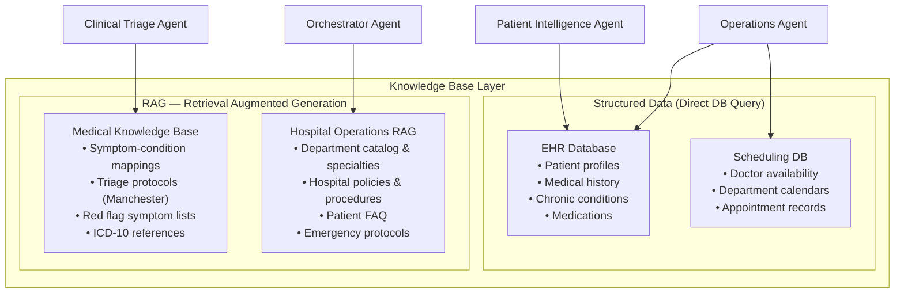
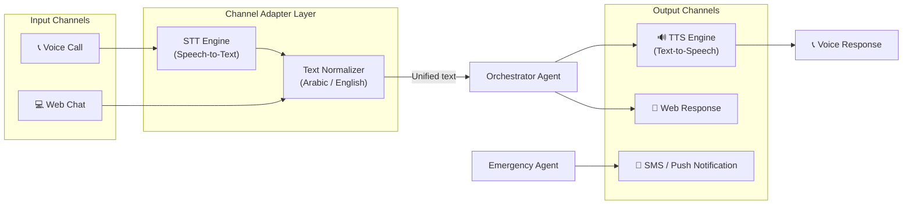
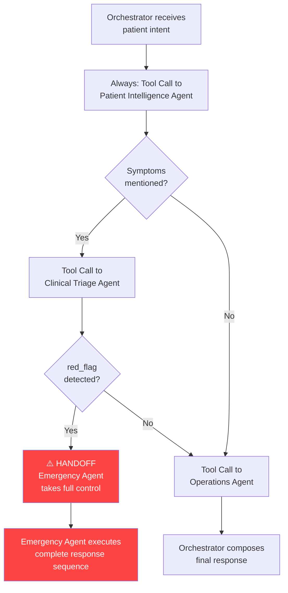
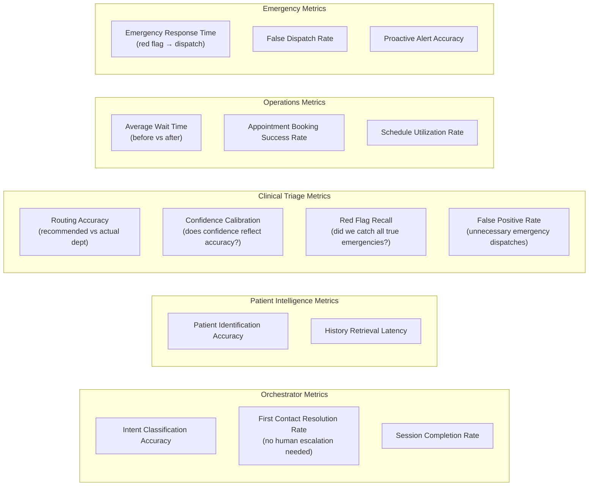
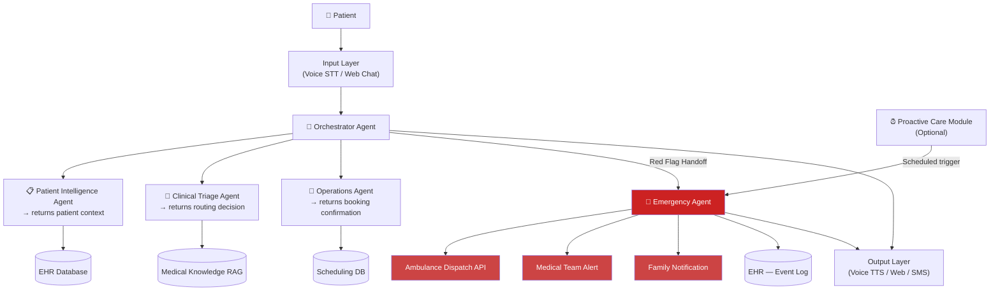

# Hospital AI Patient Agent System
## Architecture & Solution Design

---

## 1. Problem Statement

Modern hospital patient assistants are constrained by human limitations, leading to degraded patient experience and operational inefficiencies. The current system suffers from four critical pain points that this multi-agent AI solution aims to eliminate.

| Pain Point | Current Impact |
|---|---|
| **High Wait Time** | Patients wait extensively before reaching an assistant |
| **Limited Availability** | System not responsive 24/7; peak hours cause bottlenecks |
| **No Patient History** | Every interaction starts from scratch, zero context |
| **Untapped Loyalty** | Known patients with chronic conditions treated as strangers |

---

## 2. Realistic Assumptions

> All assumptions below are grounded in standard hospital infrastructure.

| # | Assumption | Rationale |
|---|---|---|
| 1 | Hospital has an **EHR system** (e.g., Epic, Cerner) with patient history, chronic conditions, medications, and past visits | Industry standard for any mid-to-large hospital |
| 2 | Hospital has a **scheduling system** with doctor availability and department calendars | Standard operational tooling |
| 3 | Patients have registered **profiles** with phone numbers and basic medical flags | Required for loyalty identification |
| 4 | An **emergency dispatch API** exists or can be integrated | Realistic for hospitals with ambulance services |
| 5 | After each visit, the hospital system **logs the actual department** the patient was routed to | Used for triage performance feedback loop |
| 6 | Historical **wait time data** exists as a baseline for measuring improvement | Available from current system logs |
| 7 | Patients interact via **Voice Calls** and **Web Chat** as primary channels | Defined scope of interaction layer |

---

## 3. Solution Overview

Replace the human patient assistant with a **multi-agent AI system** composed of 5 specialized agents orchestrated by a central hub. The system understands natural language, accesses patient history, triages symptoms using LLM reasoning, manages scheduling, and handles emergencies proactively.

---

## 4. System Architecture

### 4.1 High-Level Architecture



---

### 4.2 Agent Interaction & Control Flow



---

### 4.3 Emergency Flow (Detailed)



---

### 4.4 Proactive Care Module (Optional Extension)



---

## 5. Agent Specifications

### Agent 1 — Orchestrator Agent

| Attribute | Detail |
|---|---|
| **Role** | Central hub; maintains full conversation state and control |
| **Control Type** | Always in control — never fully hands off except to Emergency Agent |
| **Inputs** | Normalized text from Input Layer |
| **Outputs** | Final response to patient (text or voice) |

**Tools:**
- `identify_patient(phone / name / ID)` → calls Patient Intelligence Agent
- `detect_intent(message)` → classifies: appointment / symptom / emergency / inquiry
- `retrieve_hospital_faq(query)` → RAG on hospital policies & procedures
- `route_to_agent(agent_name, payload)` → dispatches to appropriate agent

---

### Agent 2 — Patient Intelligence Agent

| Attribute | Detail |
|---|---|
| **Role** | Single source of truth for patient context |
| **Control Type** | Tool Call — stateless, returns data and exits |
| **Inputs** | Patient identifier (phone / ID) |
| **Outputs** | Patient context package |

**Tools:**
- `get_patient_profile(id)` → EHR lookup: demographics, contact info
- `get_medical_history(id)` → past diagnoses, surgeries, allergies
- `get_chronic_conditions(id)` → flagged long-term conditions
- `get_loyalty_status(id)` → visit frequency, registration date, loyalty tier
- `get_last_visit(id)` → most recent interaction details

**Output Schema:**
```json
{
  "patient_id": "P-00123",
  "name": "Ahmed Hassan",
  "age": 67,
  "chronic_conditions": ["Diabetes Type 2", "Hypertension"],
  "current_medications": ["Metformin", "Amlodipine"],
  "loyalty_status": "HIGH",
  "last_visit": "2025-05-20",
  "primary_doctor": "Dr. Salah — Endocrinology",
  "emergency_contact": "+20-1XX-XXXXXXX"
}
```

---

### Agent 3 — Clinical Triage Agent

| Attribute | Detail |
|---|---|
| **Role** | Symptom understanding and department routing using LLM reasoning |
| **Control Type** | Tool Call — Orchestrator stays in control; red flag signals trigger Emergency handoff |
| **Inputs** | Raw symptoms + patient context from Agent 2 |
| **Outputs** | Structured routing decision |

> **Key Design Decision:** This agent uses **real LLM reasoning** over medical knowledge — not rule-based mapping. The same symptom ("I feel dizzy") produces different routing decisions based on patient age, chronic conditions, and symptom context.

**Tools:**
- `retrieve_medical_knowledge(symptoms)` → RAG on symptom-condition mappings
- `get_department_catalog()` → hospital department list and specialties
- `check_red_flags(symptoms)` → fast-path check before full reasoning
- `assess_urgency(symptoms, patient_context)` → urgency classification

**Red Flag Fast Path (bypasses full reasoning):**
```
"Severe chest pain"          → Emergency immediately
"Loss of consciousness"      → Emergency immediately
"Severe difficulty breathing"→ Emergency immediately
"Signs of stroke"            → Emergency immediately
```

**Confidence Threshold Logic:**
```
confidence ≥ 0.80  →  Route to recommended department
confidence 0.60–0.79 →  Ask one clarifying question, re-evaluate
confidence < 0.60  →  Escalate to human agent
```

**Output Schema:**
```json
{
  "recommended_department": "Cardiology",
  "urgency_level": "HIGH",
  "confidence_score": 0.89,
  "red_flag_detected": false,
  "reasoning": "Patient (67y, hypertensive) reports chest pressure
                with shortness of breath. Symptom profile aligns
                with possible cardiac event. Immediate evaluation
                recommended.",
  "alternative_departments": ["Emergency", "Internal Medicine"],
  "clarifying_questions": [],
  "escalate_to_human": false
}
```

---

### Agent 4 — Operations Agent

| Attribute | Detail |
|---|---|
| **Role** | Scheduling, queue management, and availability |
| **Control Type** | Tool Call — stateless, handles booking logic and returns confirmation |
| **Inputs** | Department + urgency level + patient preferences |
| **Outputs** | Appointment confirmation or queue status |

**Tools:**
- `get_doctor_availability(department, urgency)` → available slots ranked by urgency priority
- `book_appointment(patient_id, doctor_id, slot)` → creates appointment in scheduling system
- `get_queue_status(department)` → current wait time estimation
- `send_confirmation(patient_contact, appointment_details)` → SMS / notification
- `reschedule_appointment(appointment_id, new_slot)` → handles changes

---

### Agent 5 — Emergency Agent

| Attribute | Detail |
|---|---|
| **Role** | Handles all emergency scenarios; executes full response sequence |
| **Control Type** | **Full Handoff** — takes complete control from Orchestrator |
| **Inputs** | Patient context + triage output + emergency trigger reason |
| **Outputs** | Dispatch confirmation + patient notification + record update |

**Tools:**
- `dispatch_ambulance(patient_location, condition_summary)` → triggers emergency dispatch API
- `alert_medical_team(department, patient_context)` → notifies ER team
- `notify_emergency_contact(contact_info, message)` → alerts family
- `update_patient_record(patient_id, event)` → logs emergency event in EHR
- `send_patient_confirmation(channel, message)` → confirms action to patient

**Triggers:**
- Reactive: red flag detected in triage flow
- Proactive *(optional)*: scheduler finds critical event in EHR monitoring

---

## 6. Knowledge Base Architecture



| Knowledge Type | Storage | Used By | Update Frequency |
|---|---|---|---|
| Patient Records | EHR DB (structured) | Agent 2, Agent 4 | Real-time |
| Doctor Schedules | Scheduling DB | Agent 4 | Real-time |
| Medical Knowledge | RAG index | Agent 3 | Monthly / on update |
| Hospital Policies | RAG index | Orchestrator | Quarterly / on update |
| Emergency Protocols | RAG index | Agent 3, Agent 5 | On update |

---

## 7. Channel Layer (Input / Output)



> The Orchestrator always receives and processes **unified normalized text** regardless of channel. Channel-specific rendering happens in the Output Layer.

---

## 8. Tool Call vs. Handoff Decision



| Agent | Control Type | Reason |
|---|---|---|
| Patient Intelligence | Tool Call | Stateless data retrieval |
| Clinical Triage | Tool Call | Returns routing decision; Orchestrator stays in control |
| Operations | Tool Call | Stateless booking and scheduling |
| Emergency | **Full Handoff** | Time-critical; needs to own the full response sequence |

---

## 9. Performance Measurement

### 9.1 Assumed Feedback Loop

> **Assumption:** After each patient visit, the hospital system logs the actual department visited. This enables comparison with the system's recommended department.

### 9.2 Metrics per Agent



### 9.3 System-Level KPIs

| KPI | Measurement Method | Target |
|---|---|---|
| Average Wait Time Reduction | Historical baseline vs live average | > 60% reduction |
| First Contact Resolution Rate | Sessions resolved without human | > 80% |
| Triage Routing Accuracy | Recommended dept vs actual dept (logged) | > 85% |
| Emergency Response Time | Timestamp: red flag detected → dispatch | < 90 seconds |
| Red Flag Recall | True emergency caught / total true emergencies | > 99% |
| False Emergency Dispatch Rate | Unnecessary dispatches / total dispatches | < 2% |
| Patient Satisfaction Score | Post-session rating (1–5) | > 4.2 avg |

---

## 10. Complete Data Flow Summary



---

## 11. Architecture Decision Log

| Decision | Options Considered | Chosen | Reason |
|---|---|---|---|
| Agent control model | Full handoff vs Hub-and-Spoke vs Hybrid | **Hybrid** | Orchestrator controls all except Emergency |
| Clinical Triage type | Rule-based vs LLM Reasoning | **LLM Reasoning** | Natural language symptoms require real understanding |
| Emergency control | Tool Call vs Handoff | **Handoff** | Time-critical; needs to own full response sequence |
| Clinical Triage control | Handoff vs Tool Call | **Tool Call** | Returns a decision; Orchestrator acts on it |
| Knowledge Base | DB only vs RAG only vs Both | **Both** | Structured for patient data, RAG for medical knowledge |
| Channel scope | Single vs Multi-channel | **Multi** (Voice + Web) | Realistic patient interaction coverage |
| Proactive module | Built-in vs Optional Extension | **Optional** | Core system works without it; adds complexity |
| Confidence fallback | Human escalation vs Re-prompt | **Threshold-based** | <0.60 → human; 0.60–0.79 → clarify; >0.80 → route |

---

*Document generated as part of Hospital AI Patient Agent System — Architecture & Solution Design*
*All assumptions are realistic and grounded in standard hospital infrastructure.*
